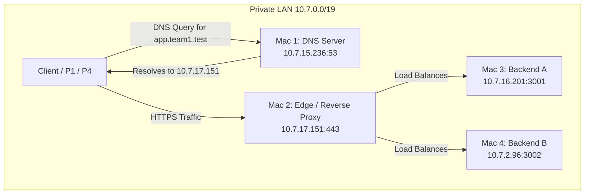

# Team Network Inventory & Topology (SCRIPT 0)

## Domain
**Domain Name:** `team1.test`
- `app.team1.test` -> `10.7.17.151` (Mac 2 Edge)
- `api.team1.test` -> `10.7.17.151` (Mac 2 Edge)

## IP & Service Inventory
| Role | Assignee | IP Address | Subnet / Gateway | Services / Ports |
| :--- | :--- | :--- | :--- | :--- |
| **Mac 1** | P1 (You) | `10.7.15.236` | `255.255.224.0` / `10.7.0.1` | **DNS Server**: port `53` (dnsmasq) |
| **Mac 2** | P2 | `10.7.17.151` | *(Same LAN)* | **Edge/nginx**: port `443` or `8443` |
| **Mac 3** | P3 | `10.7.16.201` | *(Same LAN)* | **Backend A**: port `3001` (HTTP REST) |
| **Mac 4** | P4 | `10.7.2.96` | *(Same LAN)* | **Backend B**: port `3002` (HTTP REST) |

## Topology Diagram

